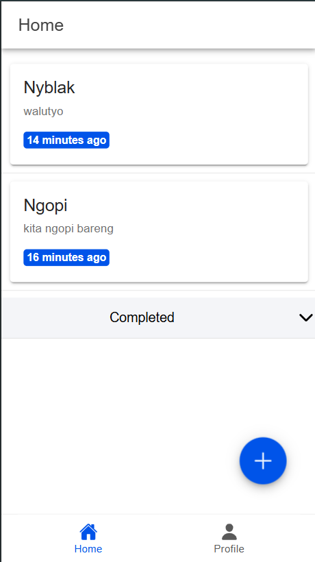

---

# Dokumentasi Aplikasi Todo List

## 1. Tampilan Awal Setelah Login



Setelah login berhasil, pengguna diarahkan ke halaman utama yang menampilkan daftar todo. Data ditampilkan menggunakan `ListView.builder` untuk memuat daftar secara dinamis dari API atau database.

**Kode utama untuk menampilkan daftar todo**:  
```dart
@override
Widget build(BuildContext context) {
  return Scaffold(
    appBar: AppBar(
      title: Text('Daftar Todo'),
    ),
    body: ListView.builder(
      itemCount: todos.length, // jumlah todo
      itemBuilder: (context, index) {
        final todo = todos[index];
        return ListTile(
          title: Text(todo.title),
          subtitle: Text(todo.description),
          trailing: Icon(todo.isCompleted ? Icons.check_circle : Icons.circle),
          onTap: () => viewTodoDetails(todo),
        );
      },
    ),
  );
}
```

---

## 2. Tampilan Tambah Data


Formulir untuk menambahkan data todo terdiri dari input untuk nama tugas, deskripsi, dan tanggal jatuh tempo. Data dikirim menggunakan fungsi `addTodo`.

**Kode utama untuk menambahkan data**:  
```dart
void addTodo(String title, String description, DateTime dueDate) {
  setState(() {
    todos.add(Todo(
      title: title,
      description: description,
      dueDate: dueDate,
      isCompleted: false,
    ));
  });
}

@override
Widget build(BuildContext context) {
  return Scaffold(
    appBar: AppBar(title: Text('Tambah Todo')),
    body: Padding(
      padding: const EdgeInsets.all(16.0),
      child: Column(
        children: [
          TextField(
            controller: titleController,
            decoration: InputDecoration(labelText: 'Nama Tugas'),
          ),
          TextField(
            controller: descriptionController,
            decoration: InputDecoration(labelText: 'Deskripsi'),
          ),
          ElevatedButton(
            onPressed: () {
              addTodo(titleController.text, descriptionController.text, DateTime.now());
              Navigator.pop(context);
            },
            child: Text('Tambah'),
          ),
        ],
      ),
    ),
  );
}
```

---

## 3. Tampilan Edit Data


Halaman ini memungkinkan pengguna memperbarui data todo yang sudah ada.

**Kode utama untuk mengedit data**:  
```dart
void editTodo(int index, String title, String description) {
  setState(() {
    todos[index].title = title;
    todos[index].description = description;
  });
}

@override
Widget build(BuildContext context) {
  return Scaffold(
    appBar: AppBar(title: Text('Edit Todo')),
    body: Padding(
      padding: const EdgeInsets.all(16.0),
      child: Column(
        children: [
          TextField(
            controller: titleController..text = todos[index].title,
            decoration: InputDecoration(labelText: 'Nama Tugas'),
          ),
          TextField(
            controller: descriptionController..text = todos[index].description,
            decoration: InputDecoration(labelText: 'Deskripsi'),
          ),
          ElevatedButton(
            onPressed: () {
              editTodo(index, titleController.text, descriptionController.text);
              Navigator.pop(context);
            },
            child: Text('Simpan'),
          ),
        ],
      ),
    ),
  );
}
```

---

## 4. Tampilan Delete Data


Fitur ini menghapus data todo setelah konfirmasi.

**Kode utama untuk menghapus data**:  
```dart
void deleteTodo(int index) {
  setState(() {
    todos.removeAt(index);
  });
}

void confirmDelete(int index) {
  showDialog(
    context: context,
    builder: (context) => AlertDialog(
      title: Text('Hapus Todo'),
      content: Text('Apakah Anda yakin ingin menghapus tugas ini?'),
      actions: [
        TextButton(
          onPressed: () => Navigator.pop(context),
          child: Text('Batal'),
        ),
        TextButton(
          onPressed: () {
            deleteTodo(index);
            Navigator.pop(context);
          },
          child: Text('Hapus'),
        ),
      ],
    ),
  );
}
```

---

## 5. Tampilan Update Status


Pengguna dapat mengubah status todo, seperti dari "Belum Selesai" menjadi "Sedang Dikerjakan."

**Kode utama untuk update status**:  
```dart
void updateStatus(int index, bool isCompleted) {
  setState(() {
    todos[index].isCompleted = isCompleted;
  });
}
```

---

## 6. Tampilan Complete Todo


Fitur ini memungkinkan pengguna untuk menandai todo sebagai selesai.

**Kode utama untuk menandai todo selesai**:  
```dart
void markAsComplete(int index) {
  setState(() {
    todos[index].isCompleted = true;
  });
}
```

---

Semoga template ini membantu, dan Anda dapat menambahkan detail lebih sesuai dengan aplikasi yang sedang Anda kerjakan! 😊
