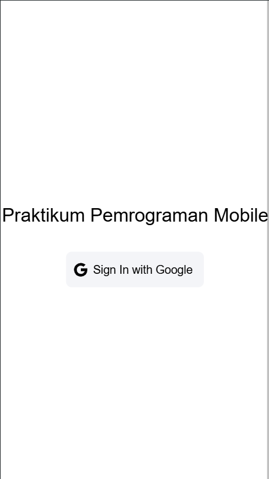
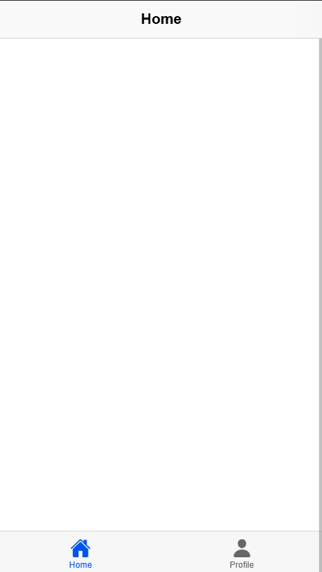
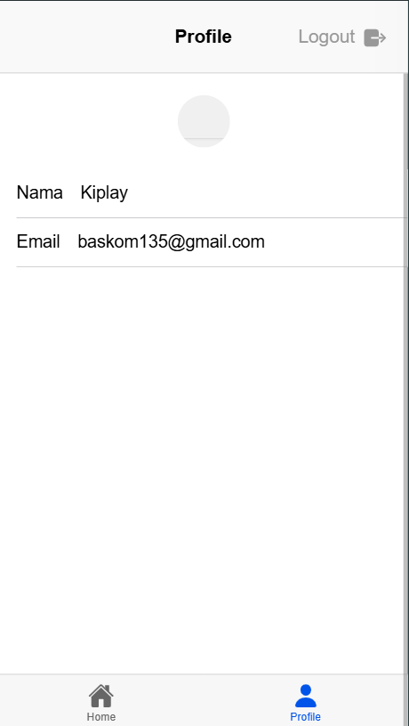

# **Ionic Vue Firebase Authentication**

---

## **1. Instalasi dan Konfigurasi Firebase**

1. **Buat proyek Firebase:**
   - Masuk ke [Firebase Console](https://console.firebase.google.com/)..

2. **Aktifkan autentikasi Google:**
   - Di Firebase Console, buka **Authentication** > **Sign-in Method**.
   - Aktifkan metode login dengan **Google**.

3. **Dapatkan konfigurasi Firebase:**
   - Di **Project Settings**, pilih **Your apps** > Tambahkan aplikasi Web.
   - Salin konfigurasi Firebase (`apiKey`, `authDomain`, dll.).

4. **Tambahkan konfigurasi Firebase ke aplikasi:**
   - Buat file `src/utils/firebase.ts` dan tambahkan konfigurasi Firebase:
     ```typescript
     const firebaseConfig = {
         apiKey: "<API_KEY>",
         authDomain: "<AUTH_DOMAIN>",
         projectId: "<PROJECT_ID>",
         storageBucket: "<STORAGE_BUCKET>",
         messagingSenderId: "<MESSAGING_SENDER_ID>",
         appId: "<APP_ID>",
     };
     ```

---

## **2. Integrasi Google Authentication**

1. **Tambahkan dependensi:**
   ```bash
   npm install --save @codetrix-studio/capacitor-google-auth firebase
   ```

2. **Konfigurasi Google Sign-In:**
   - Tambahkan **Client ID** dari Google API Console di file `auth.ts`:
     ```typescript
     await GoogleAuth.initialize({
         clientId: "<CLIENT_ID>",
         scopes: ['profile', 'email'],
         grantOfflineAccess: true,
     });
     ```

3. **Fungsi login dengan Google:**
   - Saat pengguna menekan tombol **Sign In**, fungsi berikut akan dijalankan:
     ```typescript
     const googleUser = await GoogleAuth.signIn();
     const idToken = googleUser.authentication.idToken;
     const credential = GoogleAuthProvider.credential(idToken);
     const result = await signInWithCredential(auth, credential);
     user.value = result.user;
     router.push('/home');
     ```

---

## **3. Menyimpan Status Autentikasi**

1. **Firebase State Management:**
   - Gunakan **Pinia** untuk menyimpan informasi pengguna:
     ```typescript
     const user = ref<User | null>(null);
     onAuthStateChanged(auth, (currentUser) => {
         user.value = currentUser;
     });
     ```

2. **Autentikasi otomatis:**
   - Aplikasi akan memeriksa status autentikasi pengguna menggunakan:
     ```typescript
     router.beforeEach(async (to, from, next) => {
         if (to.meta.isAuth && !authStore.isAuth) {
             next('/login');
         } else {
             next();
         }
     });
     ```

---

## **4. Mendapatkan Informasi Profil**


1. **Login Page**
    
   - Berikut merupakan tampilan Login awal:
     ```typescript
     <!-- Title -->
       <ion-text style="margin-bottom: 20px; text-align: center;">
         <h1>Praktikum Pemrograman Mobile</h1>
       </ion-text>

     <!-- Button Sign In -->
       <ion-button @click="login" color="light">
         <ion-icon slot="start" :icon="logoGoogle"></ion-icon>
         <ion-label>Sign In with Google</ion-label>
       </ion-button>
     ```

2. **Tampilan Home:**
   
   - Berikut merupakan Tampilan home:
     ```typescript
     <ion-page>
      <ion-header :translucent="true">
        <ion-toolbar>
          <ion-title>Home</ion-title>
        </ion-toolbar>
      </ion-header>
  
      <ion-content :fullscreen="true">
        <div>
        </div>
        <TabsMenu />
      </ion-content>
  
      </ion-page>
     ```

3. **Menampilkan profil pengguna:**
   - Pada halaman **Profile**, data seperti nama dan email ditampilkan menggunakan:
     ```html
     <ion-input label="Nama" :value="user?.displayName" readonly />
     <ion-input label="Email" :value="user?.email" readonly />
     ```
     
   - foto profil diambil dari:
     ```typescript
      console.log('Image loaded successfully', userPhoto)"
     />
     ```
---

## **5. Struktur Router**

1. **Konfigurasi rute dengan proteksi autentikasi:**
   - File `router/index.ts` mengatur navigasi berbasis status login:
     ```typescript
     const routes: Array<RouteRecordRaw> = [
         { path: '/', redirect: '/login' },
         { path: '/login', component: LoginPage },
         { path: '/home', component: HomePage, meta: { isAuth: true } },
         { path: '/profile', component: ProfilePage, meta: { isAuth: true } },
     ];
     ```

2. **Proteksi rute:**
   - Rute yang membutuhkan login diverifikasi sebelum pengguna dapat mengaksesnya:
     ```typescript
     router.beforeEach((to, from, next) => {
         if (to.meta.isAuth && !authStore.isAuth) {
             next('/login');
         } else {
             next();
         }
     });
     ```

---

## **6. Tampilan Halaman**

1. **LoginPage:**
   - Tombol login menggunakan Google:
     ```html
     <ion-button @click="login" color="light">
         <ion-icon slot="start" :icon="logoGoogle"></ion-icon>
         <ion-label>Sign In with Google</ion-label>
     </ion-button>
     ```

2. **HomePage:**
   - Halaman utama setelah login.

3. **ProfilePage:**
   - Menampilkan nama, email, dan foto pengguna.

---

## **7. Menjalankan Aplikasi**

1. **Jalankan aplikasi:**
   ```bash
   ionic serve
   ```

2. **Akses URL:**
   - Tambahkan URL seperti `http://localhost:8100` di **Authorized JavaScript Origins** di Google API Console.

3. **Login dan lihat profil:**
   - Masuk dengan Google dan akses data profil.
